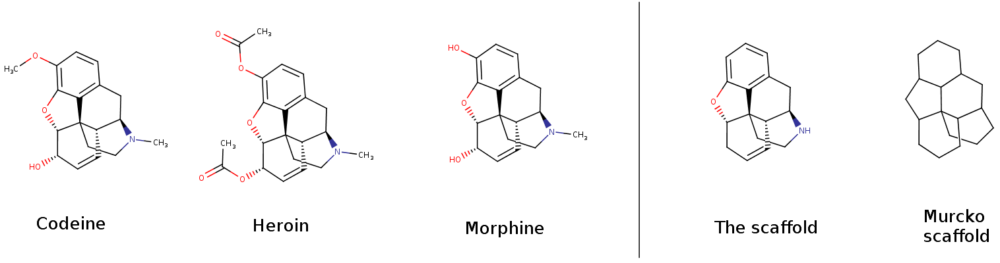
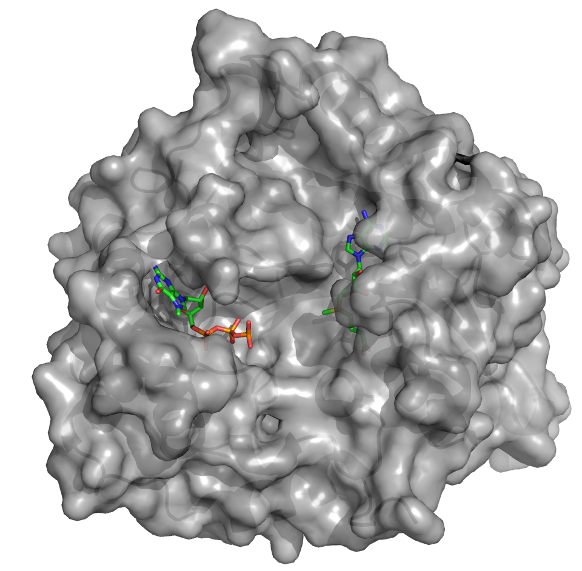
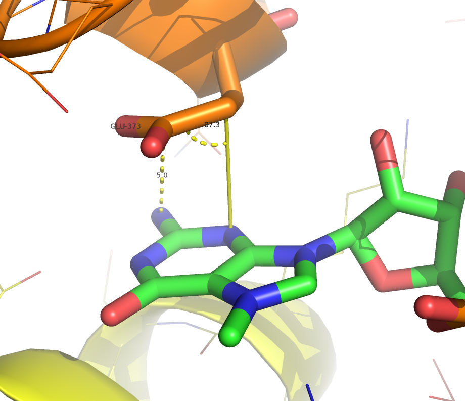

ABC of Chemoinformatics
==================

... with focus on macromolecule-ligand interactions. Inspired by magnus' [RNA Structural Bioinformatics Crash Course](https://github.com/mmagnus/RNA-Structural-Bioinformatics-Crash-Course/blob/master/README.md#rna-structural-bioinformatics-crash-course)

TOC
==================

  * [Intro \- to read](#intro---to-read)
    * [Basic concepts](#basic-concepts)
      * [Molecular scaffolds](#molecular-scaffolds)
      * [Ligands activity measures](#ligands-activity-measures)
  * [Software](#software)
    * [Drawing and visualizing small molecules](#drawing-and-visualizing-small-molecules)
    * [Molecule formats and formats conversion](#molecule-formats-and-formats-conversion)
    * [PyMOL](#pymol)
      * [Installing under debian/ubuntu/mint](#installing-under-debianubuntumint)
      * [Usage](#usage)
    * [UCSF Chimera (optional)](#ucsf-chimera-optional)
      * [Useful tutorials and howtos:](#useful-tutorials-and-howtos)
    * [KNIME](#knime)
    * [Molecular docking](#molecular-docking)
      * [AutoDock Vina](#autodock-vina)
      * [rDock](#rdock)
      * [Results' rescoring](#results-rescoring)
      * [Other programs](#other-programs)
  * [Databases and online tools :: macromolecules](#databases-and-online-tools--macromolecules)
    * [Scientific literature](#scientific-literature)
    * [Patents](#patents)
    * [Sequences](#sequences)
      * [Similar sequences](#similar-sequences)
      * [Sequences Alignment](#sequences-alignment)
    * [Other](#other)
    * [PDB](#pdb)
      * [Tools](#tools)
      * [Homology modeling](#homology-modeling)
  * [Databases and online tools :: small molecules](#databases-and-online-tools--small-molecules)
    * [Chemical structures](#chemical-structures)
    * [Activity](#activity)
    * [Other](#other-1)
    * [Drugs](#drugs)
    * [ADMET properties estimation](#admet-properties-estimation)
      * [Cytochrome P450](#cytochrome-p450)
  * [Other tools and useful links](#other-tools-and-useful-links)
  * [Software corner](#software-corner)
    * [Linux and Bash](#linux-and-bash)
    * [Git](#git)
    * [Gitlab](#gitlab)
    * [Markdown](#markdown)
  * [RNA Structural Bioinformatics](#rna-structural-bioinformatics)
  * [Science](#science)
  * [Fun (optional)](#fun-optional)

Created by [gh-md-toc](https://github.com/ekalinin/github-markdown-toc.go)

# Intro - to read

- https://en.wikipedia.org/wiki/Enzyme_inhibitor
- https://en.wikipedia.org/wiki/Enzyme_assay
- https://en.wikipedia.org/wiki/Biological_target
- https://en.wikipedia.org/wiki/Drug_design
- https://en.wikipedia.org/wiki/ADME
- https://en.wikipedia.org/wiki/Quantitative_structure%E2%80%93activity_relationship
- https://en.wikipedia.org/wiki/Docking_%28molecular%29

## Basic concepts

### Molecular scaffolds

### Ligands activity measures

* **IC50** - half maximal inhibitory concentration [wiki](https://en.wikipedia.org/wiki/IC50)
  *  **pIC50** = -log(IC50)
* **EC50** - half maximal effective concentration
* **LD50**  - median lethal dose
* **Ki** - binding affinity - describes the interaction of most ligands with their binding sites; high-affinity ligand binding results from greater intermolecular force between the ligand and its receptor while low-affinity ligand binding involves less intermolecular force between the ligand and its receptor. In general, high-affinity binding involves a longer residence time for the ligand at its receptor binding site than is the case for low-affinity binding. 

The median affinity (IC50, EC50, ED50, Ki, Kd) for current small-molecule drugs is around **20 nM** (source: doi:10.1038/nrd2199)

# Software

## Drawing and visualizing small molecules

MarvinSketch from MarvinBeans Suite. Download for free (after registration): https://www.chemaxon.com/download/marvin-suite/#mbeans

:zap: **Practicals:**
- Draw the LSD molecule
- Save it as smiles, mol2, sdf
- copy it to clipboard as smiles and paste to the notepad
- optimize the 3D structure

## Molecule formats and formats conversion

- http://openbabel.org/wiki/Main_Page
- http://openbabel.org/docs/current/Command-line_tools/babel.html

:zap: **Practicals:**
- convert saved molecules to sdf, mol2 and PDB
- add hydrogens
- optimize 3D structure
- generate conformers

## PyMOL

### Installing under debian/ubuntu/mint

- download the script: https://raw.githubusercontent.com/filipsPL/ABChemoinformatics/master/compile-pymol.sh
- make it executable: `chmod +x compile-pymol.sh`
- run compilation `./compile-pymol.sh`
- run pymol `/opt/pymol-svn/pymol`

### Usage

- Practical Pymol for Beginners http://www.pymolwiki.org/index.php/Practical_Pymol_for_Beginners
- http://www.pymolwiki.org/index.php/Gallery
- See also: https://github.com/mmagnus/RNA-Structural-Bioinformatics-Crash-Course/blob/master/README.md#pymol

:zap: **Practicals:**

For protein 4N49 prepare images:

- general view of the complex; transparency, raytracing

- hydrogen bond network in the binding pocket:

- distance and angles measurement; sidechains labelling:
 

## UCSF Chimera (optional)

Another strucute visualisation/editing program.
- Download: https://www.cgl.ucsf.edu/chimera/download.html
- Getting started: https://www.cgl.ucsf.edu/Outreach/Tutorials/GettingStarted.html

### Useful tutorials and howtos:
- how to make high-quality images of a protein surface colored by hydrophobicity and electrostatic potential: https://www.cgl.ucsf.edu/chimera/docs/UsersGuide/tutorials/surfprop.html
- Self-Guided Volume Data Exercises: https://www.cgl.ucsf.edu/chimera/data/tutorials/maps08/exercises.html
- Structure Analysis and Comparison Tutorial: https://www.cgl.ucsf.edu/chimera/docs/UsersGuide/tutorials/squalene.html#surfaces
- Image Tutorial: Surface Properties: https://www.cgl.ucsf.edu/chimera/current/docs/UsersGuide/tutorials/surfprop.html

:cyclone: See also: my notes about Chimera (useful commands, pymol vs chimera etc.): https://github.com/filipsPL/ABChemoinformatics/blob/master/pymol_chimera.md

:zap: **Practicals:**

For protein 4N49:

- visualize hydrophobicity surface of the protein, with limitation to 6 A around the ligand(s)
- color molecular surface using Electrostatic Potential (Coulombic is enough)

## KNIME

- Download: https://www.knime.org/knime
- Quick Start Guide: https://tech.knime.org/files/KNIME_quickstart.pdf (PDF)

:zap: **Practicals:**

- From the ChemBlDb, download IC50 activity for JAK2 Kinase
- prepare a workflow:
 - Read the data from CSV file
 - convert smiles string to structures
 - calculate moelcular descriptors: AMW, logP, TPSA
 - calculate logBB according to the formlula:  (:bulb: use Math Node)
 - calculate the pareto rank, minimizing IC50 value, MW, logP and TPSA

- For these data:
 - Create a 3D plot:
 - xyz: TPSA / logP / AMW
 - color by: IC50
 - points size: logBB
 - save as png
- play with another types of plot (parallel coordinates, bar plots, conditional bar plots etc)
- sort the table according to Pareto Ran value (ascending)
- save 10 top ranking compounds to csv and xls files.

## Molecular docking

### AutoDock Vina

- http://vina.scripps.edu/
- Official tutorial: http://vina.scripps.edu/tutorial.html
- pymol plugin: http://www.pymolwiki.org/index.php/Autodock_plugin

### rDock

- http://rdock.sourceforge.net/
- Official tutorial: http://rdock.sourceforge.net/docking-in-3-steps/

### Results' rescoring

- For RNA-ligand complexes: LigandRNA: http://ligandrna.genesilico.pl/
- For Protein-ligand complexes: NNScore 2.0: http://nbcr.ucsd.edu/data/sw/hosted/nnscore/

### Other programs

- http://www.tcd.uni-konstanz.de/research/plants.php - PLANTS - Protein-Ligand ANT System
- http://dock.compbio.ucsf.edu/ - Dock 6.x

:zap: **Practicals:**

- for complexes of interest perform redocking of the native ligands to the macromolecule structure
 - use various docking programs (AutoDock Vina, rDock...)
 - check the influence of various ligand preparation steps (eg: ligand: native X-ray structure vs optimized with openbabel vs ...)
 - check the influence of rescoring on the docking results
 - which combination gives the best results? (and what mean "best results"?)

# Databases and online tools :: macromolecules

:bangbang: :warning: **Never reveal/use confidental structures on public servers!** 

## Scientific literature
* Pubmed: http://www.ncbi.nlm.nih.gov/pubmed/
* Google scholar: https://scholar.google.pl/

## Patents
* google patents: http://www.google.com/patents
* espace net: http://worldwide.espacenet.com/
  * depatis net: https://depatisnet.dpma.de
* WIPO: https://patentscope.wipo.int/search/en/search.jsf
* https://www.surechembl.org/search/ - Open Patent Data

## Sequences

* http://www.uniprot.org/ high-quality and freely accessible resource of protein sequence and functional information.
* http://www.ebi.ac.uk/interpro/ - provides functional analysis of proteins by classifying them into families and predicting domains and important sites

### Similar sequences

* http://blast.ncbi.nlm.nih.gov/Blast.cgi?CMD=Web&PAGE=Proteins&PROGRAM=blastp&RUN_PSIBLAST=on - search protein databases using a protein query. 
* http://www.ebi.ac.uk/Tools/sss/ncbiblast/ - to find regions of sequence similarity, which will yield functional and evolutionary clues about the structure and function of your novel sequence. 
* http://toolkit.tuebingen.mpg.de/cs_blast CS-BLAST is an extension to standard NCBI BLAST that allows to increase its sensitivity by a factor of more than two on remote homologs at the same speed.
* http://toolkit.tuebingen.mpg.de/hhpred - Homology detection & structure prediction by HMM-HMM comparison
* Inne: http://toolkit.tuebingen.mpg.de/sections/search

### Sequences Alignment
* Pairwise Sequence Alignment: https://www.ebi.ac.uk/Tools/psa/
* Multiple Sequence Alignment: http://www.ebi.ac.uk/Tools/msa/clustalo/

## Other

* https://www.targetvalidation.org/ - helps answering the questions:
  - I am interested in target T: Which diseases can be treated by modulating target T?
  - I am interested in disease D: Which targets can be modulated to treat disease D?

## PDB

- http://www.rcsb.org/pdb/home/home.do - This resource is powered by the Protein Data Bank archive-information about the 3D shapes of proteins, nucleic acids, and complex assemblies that helps students and researchers understand all aspects of biomedicine and agriculture, from protein synthesis to health and disease.
- http://ndbserver.rutgers.edu/ - contains information about experimentally-determined nucleic acids and complex assemblies.

### Tools
- http://dogsite.zbh.uni-hamburg.de/ - on line pocket finder
- https://www.ebi.ac.uk/pdbsum -> Cleft analysis
- http://mole.upol.cz/ - rapid and fully automated location and characterization of channels, tunnels and pores
- Druggability: https://www.ebi.ac.uk/chembl/drugebility/structure (try: 1UV5)

### Homology modeling

Homology modeling, also known as comparative modeling of protein, refers to constructing an atomic-resolution model of the "target" protein from its amino acid sequence and an experimental three-dimensional structure of a related homologous protein (the "template"). (from: wikipedia)

- http://swissmodel.expasy.org/

-----

:zap: **Practicals:**

:bangbang: :warning: **Never reveal/use confidental structures on public servers!** 

- Find residues crutial for 2'-O-methyltransferase activity of Dengue virus type 2 (strain Thailand/16681/1984)
- Find all sequences containing mRNA cap 0-1 NS5-type MT domain
- Find reviewed sequences of Flaviviridae methyltransferases (`taxonomy: Flaviviridae`)
- Find sequences similar to the human IDO1 proteins
- What are differences between four most similar sequences?
- Find x-ray structure of Cap-specific mRNA (nucleoside-2'-O-)-methyltransferase 1 Protein in complex with m7GpppG and SAM
 - download it and visualize with pymol
 - fetch fasta sequence
 - show interactions diagram for both ligands
 - find other structures containing SAM ligand

 
# Databases and online tools :: small molecules

:bangbang: :warning: **Never reveal/use confidental structures on public servers!** 

## Chemical structures

* http://zinc.docking.org/ (aspirin) :boom:
* https://pubchem.ncbi.nlm.nih.gov/
* http://www.chemspider.com/
* http://www.emolecules.com/

## Activity
* https://www.ebi.ac.uk/chembl/ :boom:
* Also: https://pubchem.ncbi.nlm.nih.gov/ - BioAssay
* http://www.bindingdb.org/bind/index.jsp
* http://chemoinfo.ipmc.cnrs.fr/MOLDB/index.html - e-Drug3D offers a facility to explore FDA approved drugs and active metabolites.
* http://bitterdb.agri.huji.ac.il/ - currently holds over 680 bitter compounds obtained from the literature and from Merck index and their associated 25 human bitter taste receptors (hT2Rs). 
* http://www.eidogen-sertanty.com/kinasekb.php - Kinase Knowledgebase (KKB)
* https://www.ebi.ac.uk/chembl/malaria/ - resource for publicly available compounds, targets, assays and data for malaria research

## Other
* http://www.swissbioisostere.ch/ - isosters database

## Drugs
* http://www.drugbank.ca/ (1-phenyl-2-aminopropane)
* http://bidd.nus.edu.sg/group/ttd/ttd.asp (ALK)
* https://www.ebi.ac.uk/chembl/drugstore
* http://www.genome.jp/kegg/drug/ -  a comprehensive drug information resource for approved drugs in Japan, USA, and Europe unified based on the chemical structures and/or the chemical components, and associated with target, metabolizing enzyme, and other molecular interaction network information.

## ADMET properties estimation

- http://www.organic-chemistry.org/prog/peo/ - OSIRIS Property Explorer
- https://disco.chemaxon.com/apps/demos/ - ChemAxon - Calculator Plugin Demos
- http://bleoberis.bioc.cam.ac.uk/pkcsm/prediction - pkCSM: predicting small-molecule pharmacokinetic properties using graph-based signatures
- http://www.organic-chemistry.org/prog/peo/ - calculates on-the-fly various drug-relevant properties
- http://lmmd.ecust.edu.cn:8000/ - A comprehensive source and free tool for evaluating chemical ADMET properties
- http://tox.charite.de/tox/ - a webserver for the prediction of oral toxicities of small molecules in rodents! 
- http://www.swisstargetprediction.ch/ - website allows you to predict the targets of a small molecule
- http://toxnet.nlm.nih.gov/newtoxnet/hsdb.htm - a toxicology database that focuses on the toxicology of potentially hazardous chemicals. It provides information on human exposure, industrial hygiene, emergency handling procedures, environmental fate, regulatory requirements, nanomaterials, and related areas. The information in HSDB has been assessed by a Scientific Review Panel.
- http://bioinformatics.charite.de/supertoxic/index.php?site=home - collected toxic compounds from literature and web sources in the database SuperToxic. 

### Cytochrome P450

* What is Cytochrome P450: https://en.wikipedia.org/wiki/Cytochrome_P450
* http://www.farma.ku.dk/smartcyp/index.php - SMARTCyp predicts the sites in molecules that are most liable to cytochrome P450 mediated metabolism
* http://www.farma.ku.dk/whichcyp/index.php - WhichCyp predicts which P450 isoform will bind/metabolize a molecule using simple yes/no classification models. 

-----

:zap: **Practicals:**

:bangbang: :warning: **Never reveal/use confidental structures on public servers!** 

* Find all activities of the compound:

  * Download values of IC50 in the csv file

* Find all registered drugs that targets RNA
* Find possible bioisosteres of 3-methylindole (R in position 5)

* For compound named `(2S)-4-[3-(5-methyl-2-furyl)benzofuran-2-yl]-2-phenyl-butan-2-ol`
 - find vendors
 - find calculated values of logP i TPSA
 - find comercially available compounds that are similar at 80% (Tanimoto similarity)

* Find patents mentioning this structure:

* Predict various physio-chemical/ADMET properties for the aspirin

# Other tools and useful links

- https://opensourcemolecularmodeling.github.io/ - updated list of the Open Source Molecular Modeling software
- http://click2drug.org/ - Directory of computer-aided Drug Design tools

# Software corner

## Linux and Bash
- Linux Bash Shell Cheat Sheet - http://cli.learncodethehardway.org/bash_cheat_sheet.pdf (PDF)
- Other useful commands: `ssh`, `scp`

## Git

Git (/ɡɪt/) is a version control system that is widely used for software development and other version control tasks. It is a distributed revision control system with an emphasis on speed, data integrity, and support for distributed, non-linear workflows.[9] Git was created by Linus Torvalds in 2005 for development of the Linux kernel, with other kernel developers contributing to its initial development.

- https://gitlab.genesilico.pl/Tutorials/git_crash_course
- https://en.wikipedia.org/wiki/Git_%28software%29

## Gitlab

GitLab, the software, is a web-based Git repository manager with wiki and issue tracking features. 

- git - for storing files
- wiki - for documentation (and/or IPython Notebook: https://ipython.org/notebook.html)
 
## Backups

### Borg

Deduplicating archiver with compression and authenticated encryption, called  "The holy grail of backup software":

- https://borgbackup.readthedocs.io/en/stable/index.html#
- https://github.com/borgbackup/borg

## Markdown

- see: https://en.wikipedia.org/wiki/Markdown
- Mastering Markdown: https://guides.github.com/features/mastering-markdown/ 
- http://www.emoji-cheat-sheet.com/ - Emoji cheat sheet
- My notes about markdown and emoji: https://github.com/filipsPL/ABChemoinformatics/blob/master/markdown%2Bemoji.md#markdown

## Programming
- Ten simple rules for making research software more robust: http://journals.plos.org/ploscompbiol/article?id=10.1371/journal.pcbi.1005412

# RNA Structural Bioinformatics

- see: https://github.com/mmagnus/RNA-Structural-Bioinformatics-Crash-Course/blob/master/README.md#table-of-contents
- see: http://genesilico.pl/ -> "software"

# Science

- [English Communication for Scientists](http://www.nature.com/scitable/ebooks/english-communication-for-scientists-14053993/contents)

# Fun (optional)

- xkcd: https://xkcd.com/
 - explain xkcd: http://www.explainxkcd.com/
- PhD comics: http://phdcomics.com/comics.php